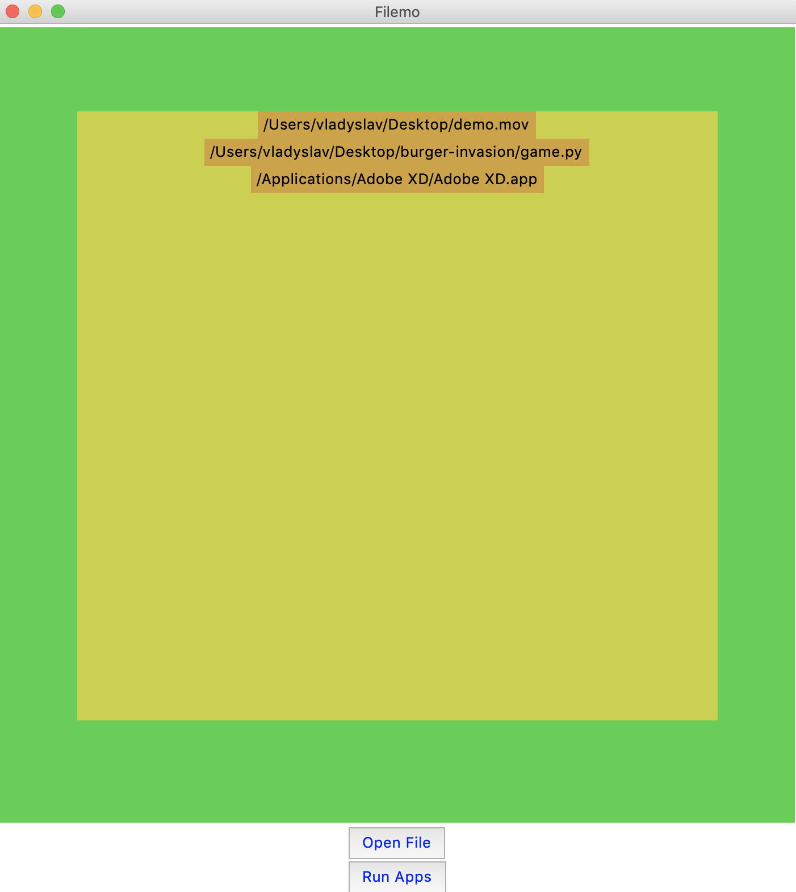

# Filemo

A python built GUI for opening applications in your local directory with one click. Two versions made for both macOS and Windows.

## Installation - 
To run this on your computer, follow these steps:
```
git clone repo
cd filemo/
python3 mac.py
```

## Installation - 
To run this on your computer, follow these steps:
```
git clone repo
cd filemo/
python3 windows.py
```

## Program

<b> Main Program GUI View </b>

<br />

<b> After adding files View </b>
<br />

## Features

|                            | macOS  | Windows |
| -------------------------- | :----------------: | :-------------: |
| Adding files           |         ✔️         |        ✔️        |
| Saving selections             |         ✔️         |        ✔️        |
| Documented commands        |         ✔️         |        ✔️        |
| Simple UI |         ✔️         |        ✔️        |
| Easy to customize          |         ✔️         |        ✔️        |
| Code Fluidity          |         ✔️         |        ✔️        |
