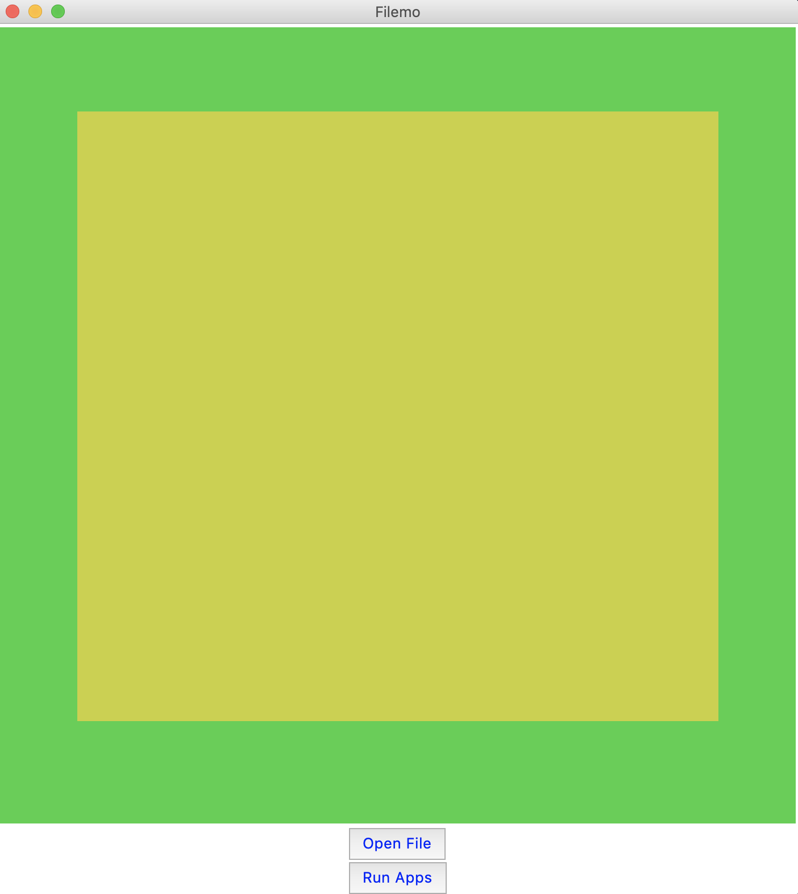

# Filemo - 

A python built GUI for opening applications in your local directory with one click. Two versions made for both macOS and Windows.

<p align="center">
  
  
  
  
 </p>

## Installation - 
To run this on your macOS computer, follow these steps:
```
git clone repo
cd filemo/
python3 mac.py
```

## Installation - 
To run this on your Windows computer, follow these steps:
```
git clone repo
cd filemo/
python3 windows.py
```

## Program

<b> Main Program GUI View </b>

<br />

<b> After adding files View </b>
<br />

## Features

|                            | macOS  | Windows |
| -------------------------- | :----------------: | :-------------: |
| Adding files           |         ✔️         |        ✔️        |
| Saving selections             |         ✔️         |        ✔️        |
| Documented commands        |         ✔️         |        ✔️        |
| Simple UI |         ✔️         |        ✔️        |
| Easy to customize          |         ✔️         |        ✔️        |
| Code Fluidity          |         ✔️         |        ✔️        |

## Contribute
If you would like to contribute to the site, create a new [pull-request](https://github.com/vladyslavnUA/filemo/pulls) and I will be sure to check it out. In addition, if you spot any 🐞's in my code, be sure to create a [new issue](https://github.com/vladyslavnUA/filemo/issues/new), I will greatly appreciate it.

## Credits
<table>
  <tr>
    <td align="center"><a href="https://github.com/vladyslavnUA"><br><sub><b>Vladyslav Nykoliuk</b><br>🐻</td>
  </tr>
</table>
